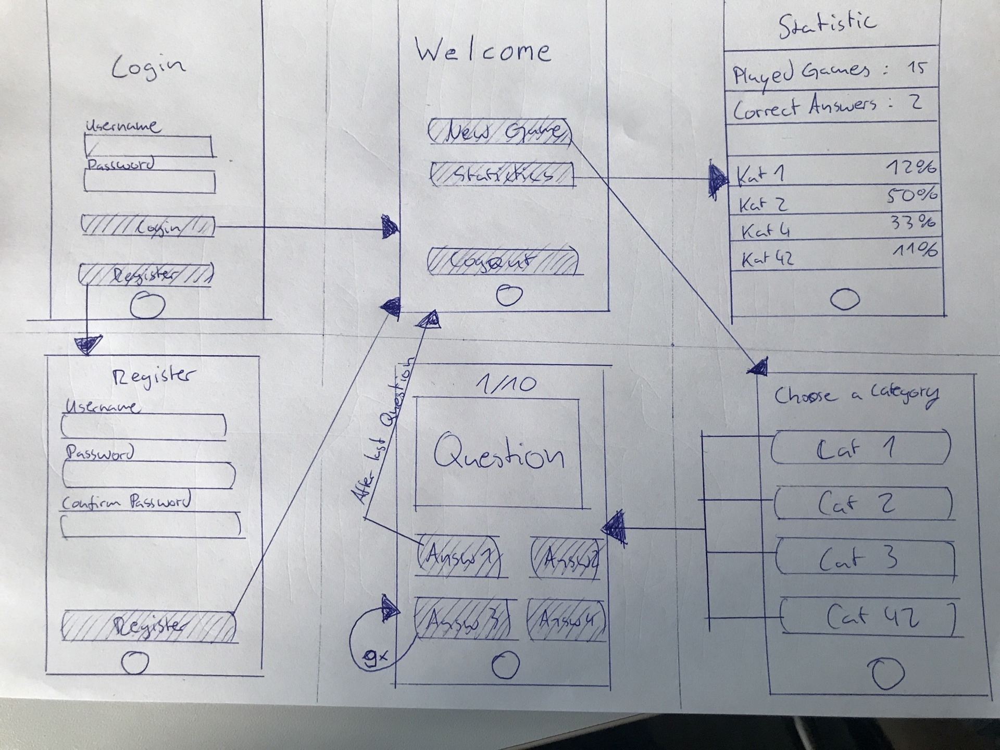
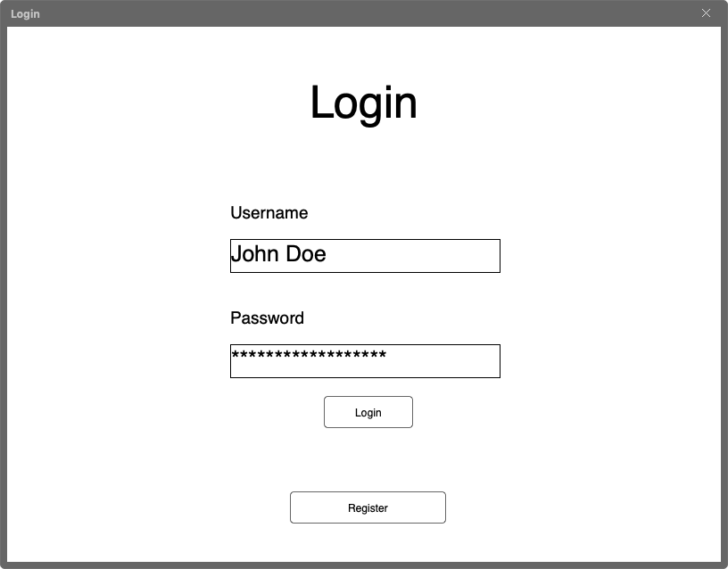
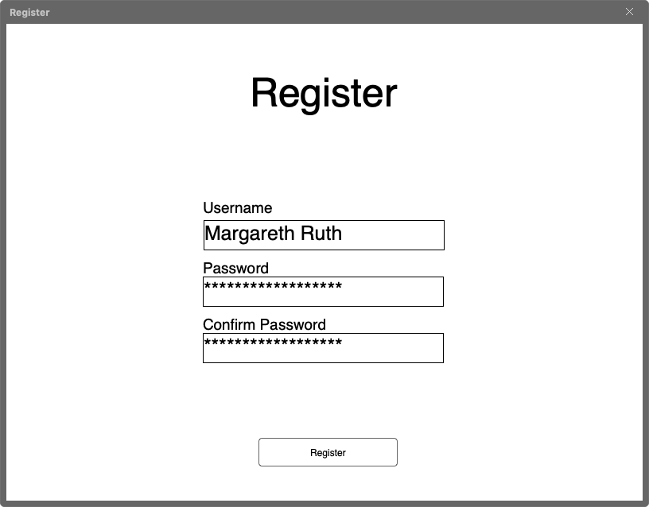
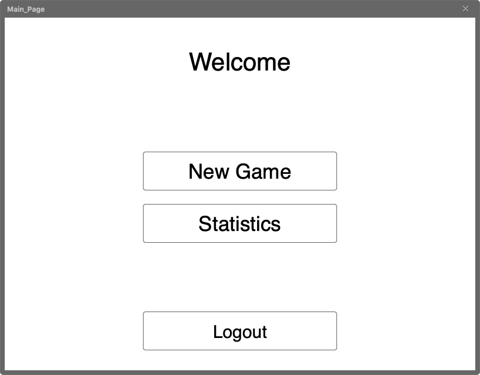
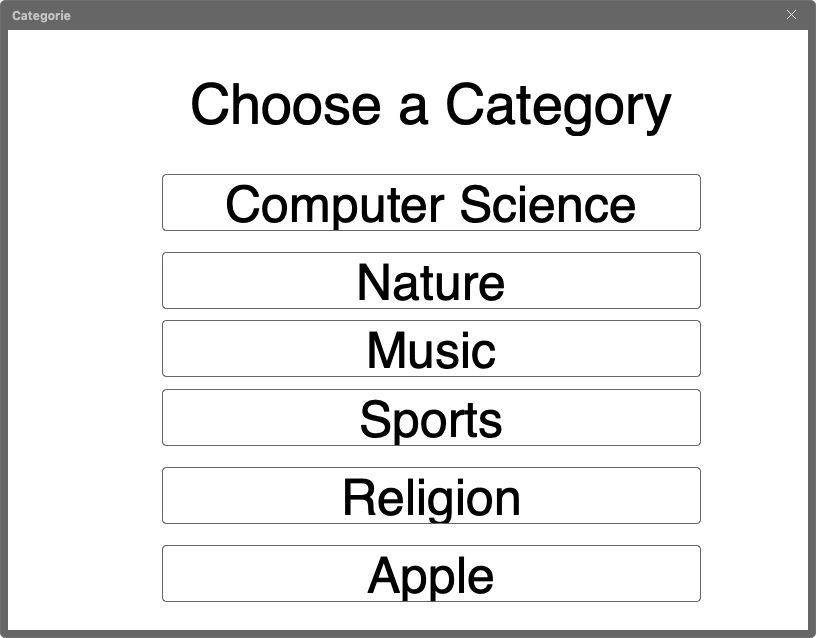
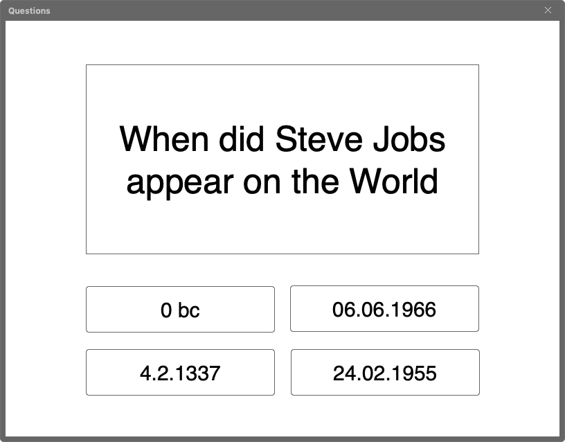
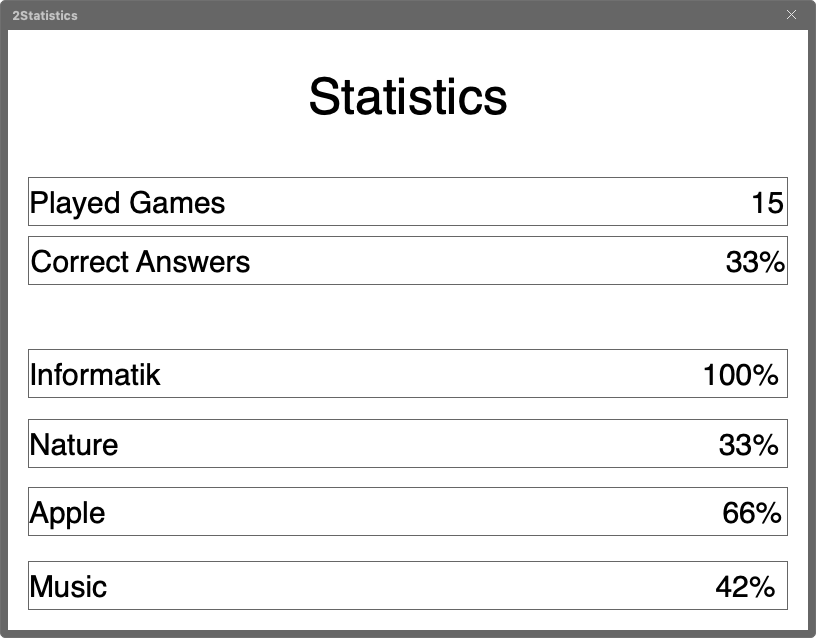
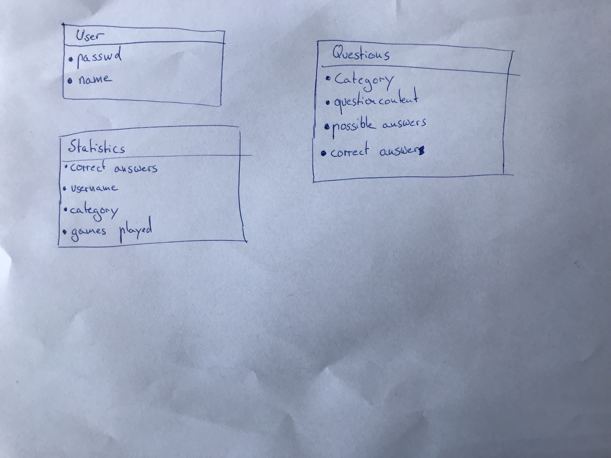

# Projektvorschlag Lorem ipsum 

**Hochschule Worms CSA 151 WS 2018/19**

Gruppe 9


Marco Bastuck
inf2551@hs-worms.de   
Matrikelnummer: 671515

David Michel
inf2702@hs-worms.de   
Matrikelnummer: 672209

---

## Abstract

Unsere Anwendung soll ein Quiz darstellen. Die wichtigsten Features die wir einbinden wollen, sind ein User-Login, verschiedene Kategorien, die der User wählen kann, innerhalb derer Fragen gestellt werden und ein Statistikteil, in dem der User verschiedenste Statistiken zu seinen bereits beantworteten Fragen einsehen kann. Die Implementierung der Fragen, des Logins und der Statistiken sollen über eine Datenbank realisiert werden, die der Client vom Server bei Bedarf abfragt. Innerhalb des User-Interfaces soll es zu dem auch möglich sein, die Statistiken nach bestimmten Gesichtspunkten zu sortieren.


## Abstract Client
Verantwortlicher: Marco Bastuck

Der Client soll aus einer Login-Page bestehen, die einen nach dem Login zur Hauptseite navigiert. Hier soll mal ein neues Quiz anfangen können und die Statistiken einsehen können. Wenn ein neues Quiz angefangen wird, wird der User erst abgefragt, in welcher Kategorie er dieses spielen möchte. Innerhalb der Statistiken lassen sich noch verschiedene Parameter zur Sortierung und Anzeige auswählen, um die Statistiken den Wünschen des Users entsprechend zu filtern.


## Wireframe


## Mobil

Im Folgenden Bild sind die Mobilversionen unserer einzelnen Screens zu sehen:




## Desktop

Folgend sind die einzelnen Screens, die im Browser erscheinen sollen, zu sehen:

### Login

Hier kann der User sich einloggen und bei Bedarf sich neu registrieren. Nach dem Login wird er auf die MainPage geleitet.



### Register

Hier kann der User einen neuen Account anlegen. Nach der Anlegung wird er eingeloggt und zur Mainpage weitergeleitet.



### MainPage

Hier kann der User sowohl ein neues Quiz starten, als auch seine bisherigen Statistiken anschauen!



### Category

Wenn der User in der Mainpage auf "New Quiz" geklickt hat, kann er nun hier eine Kategorie für eben dieses auswählen.



### Questions

Hier werden die einzelnen Fragen dargestellt, durch die der User sich durch Auswählen der Antworten durchbewegt.




### Statistics

Hier kann der User seine userspezifischen Statistiken einsehen.




## Abstract Server
Verantwortlicher: David Michel

Der Server verwaltet die Datenbank, die User, Statistiken und Fragenkatalog enthält. Er schickt auf Anfrage die entsprechenden Informationen an den Client und "verifiziert" auch den Login, wobei das Passwort hier fürs Erste nur im Klartext gespeichert wird.

## ORM

Ab eveniet maiores obcaecati omnis praesentium quisquam quos veniam voluptatibus. Ea, libero, ratione. Autem cupiditate dolorem et, magni minima minus nisi quaerat recusandae repellendus voluptatibus! A, accusamus accusantium deleniti ducimus eius eveniet fugit illo in molestiae, nisi quod, saepe tempore velit! Assumenda est nobis porro suscipit veniam.

Autem cupiditate eius est ex iure necessitatibus officiis omnis porro quod sequi?

Consequuntur incidunt iste neque nihil nulla omnis quam, saepe veritatis. Corporis labore maiores modi.

Animi aspernatur commodi consequatur libero nesciunt nisi, praesentium quidem repellendus sit sunt. Maiores, officia omnis!




## API-Beschreibung
Lorem ipsum dolor sit amet, consectetur adipisicing elit. Ad consequuntur, doloribus hic impedit quaerat quam quas qui voluptas voluptatibus! Eius facere harum nisi repellendus vel.

### `GET /login`
In dieser Route nimmt der Server Lorem entgegen.
Als Antwort liefert er ein ipsum dolor sit amet, consectetur adipisicing elit. Ad consequuntur, doloribus hic impedit quaerat quam quas qui voluptas voluptatibus! Eius facere harum nisi repellendus vel.

### `GET /register`
In dieser Route nimmt der Server Lorem entgegen.
Als Antwort liefert er ein ipsum dolor sit amet, consectetur adipisicing elit. Ad consequuntur, doloribus hic impedit quaerat quam quas qui voluptas voluptatibus! Eius facere harum nisi repellendus vel.

### `POST /loggedIn`
Lorem ipsum dolor sit amet, consectetur adipisicing elit. Ad consequuntur, doloribus hic impedit quaerat quam quas qui voluptas voluptatibus! Eius facere harum nisi repellendus vel.

### `PUT /foo`
Animi aspernatur commodi consequatur libero nesciunt nisi, praesentium quidem repellendus sit sunt. Maiores, officia omnis!

### `DELETE /foo`
Consequuntur incidunt iste neque nihil nulla omnis quam, saepe veritatis. Corporis labore maiores modi.

### Template Object

Animi aspernatur commodi consequatur libero nesciunt nisi, praesentium quidem repellendus sit sunt. Maiores, officia omnis!


```javascript
{
  success: false,
  msg: "...."
}
```

Cumque delectus laboriosam magnam maxime nam porro possimus quos recusandae!

```javascript
{
  success: true,
  foo: "$bar"
}
```

## Aufwandsschätzungen

### Frontend

Verantwortlicher: Peter Schmidt

#### Projektvorbereitung 

Cumque delectus laboriosam magnam maxime nam porro possimus quos recusandae!

| Aufgabe                                  | Zeit in Std |
|------------------------------------------|------------:|
| Wireframe Mobil Lorem                    |  4          |
| Wireframe Desktop Lorem                  |  4          |
| Beschreibung Funktionen Lorem            |  4          |
| Wireframe Lorem2                         |  4          |
| Beschreibung Funktionen Lorem2           |  4          |
| Wireframe Lorem3                         |  4          |
| Beschreibung Funktionen Lorem4           |  4          |
| Verfassen des Projektvorschlags          |  8          |
| ...                                      |  ...        |
| **Summe**                                |  **...**    |


#### Implementierung

| Aufgabe                                  | Zeit in Std |
|------------------------------------------|------------:|
| HTML-Grundgerüst Lorem                   |  2          |
| HTML-Grundgerüst Lorem2                  |  2          |
| HTML-Grundgerüst Lorem3                  |  1          |
| SCSS-Styling Breakpoint small            |  4          |
| SCSS-Styling Breakpoint medium           |  4          |
| SCSS-Styling Breakpoint large            |  4          |
| Implementierung Funktion Lorem           |  6          |
| Implementierung Funktion Lorem2          |  6          |
| Implementierung Funktion Lorem3          |  4          |
| ...                                      |  ...        |
| **Summe**                                |  **...**    |

#### Dokumentation / Tests

| Aufgabe                                  | Zeit in Std |
|------------------------------------------|------------:|
| Dokumentation Funktion Lorem             |  4          |
| Dokumentation Funktion Lorem2            |  1          |
| Dokumentation Funktion Lorem3            |  2          |
| ...                                      |  ...        |
| Vergleich SOLL / IST Stunden             |  1          |
| **Summe**                                |  **...**    |

#### Zusammenfassung
| Teil                                     | Zeit in Std |
|------------------------------------------|------------:|
| Projektvorbereitung                      |   30        |
| Implementierung                          |  ...        |
| Dokumentation / Tests                    |  ...        |
| **Summe**                                |  100        |

### Backend

Verantwortlicher: Johannes Meier

#### Projektvorbereitung

| Aufgabe                                  | Zeit in Std |
|------------------------------------------|------------:|
| Backend Endpunkte / API - Beschreibung   |  5          |
| ORM                                      |  3          |
| Verfassen des Projektvorschlags          |  2          |
| Verfassen ...                            |  5          |
| Markdown                                 |  8          |
| ...                                      |  ...        |
| **Summe**                                |  **...**    |

#### Implementierung und Validierung

| Aufgabe                                  | Zeit in Std |
|------------------------------------------|------------:|
| Setup Framework                          |             |
| - Framework express                      |  0.25       |
| - Framework jest                         |  0.5        |
| - Framework ...                          |  0.25       |
| DB ...                                   |  0          |
| - Setup                                  |  4          |
| Implementierung Auth                     |  4          |
| Implementierung Lorem-Route              |  2          |
| Implementierung Lorem2-Route             |  1          |
| Implementierung Lorem3-Route             |  8          |
| Implementierung Lorem4-Route             |  4          |
| Implementierung Validierungsschemata     |  2          |
| Implementierung Validierung Route 1      |  0.5        |
| Implementierung Validierung Route 2      |  0.5        |
| ...                                      |  ...        |
| **Summe**                                |  **...**    |

#### Dokumentation / Tests

| Aufgabe                                  | Zeit in Std |
|------------------------------------------|------------:|
| Setup Tests                              |  4          |
| Test DB                                  |  1          |
| Test Lorem1-Route                        |  1          |
| Test Lorem2-Route                        |  0.2        |
| Test Lorem3-Route                        |  2          |
| API-Dokumentation Lorem1-Route           |  4          |
| API-Dokumentation Lorem2-Route           |  2          |
| API-Dokumentation Lorem3-Route           |  1          |
| API-Dokumentation Lorem4-Route           |  1          |
| Dokumentation Lorem1-Route               |  0.5        |
| Dokumentation Lorem2-Route               |  1          |
| Dokumentation Lorem3-Route               |  1          |
| Dokumentation Lorem4-Route               |  0.5        |
| ...                                      |  ...        |
| Vergleich SOLL / IST Stunden             |  1          |
| **Summe**                                |  **...**    |


#### Zusammenfassung
| Teil                                     | Zeit in Std |
|------------------------------------------|------------:|
| Projektvorbereitung                      |  ...        |
| Implementierung                          |  ...        |
| Dokumentation / Tests                    |  ...        |
| **Summe**                                |  100        |
